.. _first-lametric-indicator-app.rst:

First Indicator App
===================

Indicator app is a native LaMetric Time app that is useful for displaying icons, numbers, text and charts that must stay on the device at all times.

There are two ways you can deliver data to the app – push and poll. "Push" means you can send data to the app in your local network and it will be delivered immediately. "Poll" app will poll for the data with some predefined time interval in local network or from the Internet. 

Local Push Indicator App
------------------------
Use "Local Push" communication type when data is not changing too often and you want it to be updated as soon as it changes. Let's create the simplest indicator app and see how it works.

1. Create Indicator App
^^^^^^^^^^^^^^^^^^^^^^^
Start by logging in to your `developer account <https://developer.lametric.com>`_ and creating new indicator app.

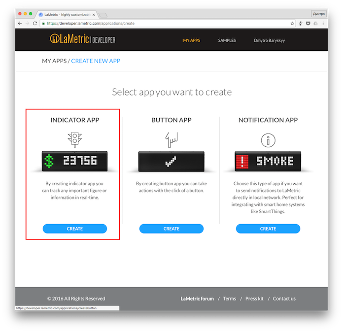

Choose an icon for your app. It will represent what we are trying to keep track of.

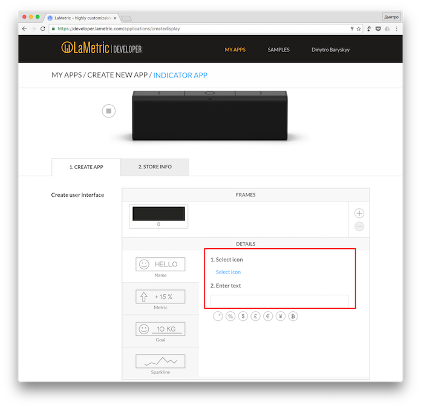

You can choose existing one or create the icon for yourself. It will be available to the whole community.

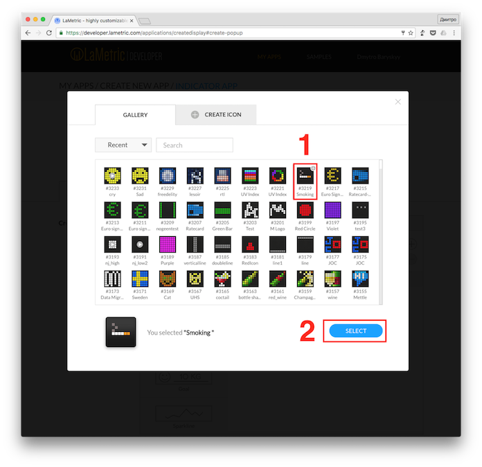

Enter initial value that will be displayed by default.

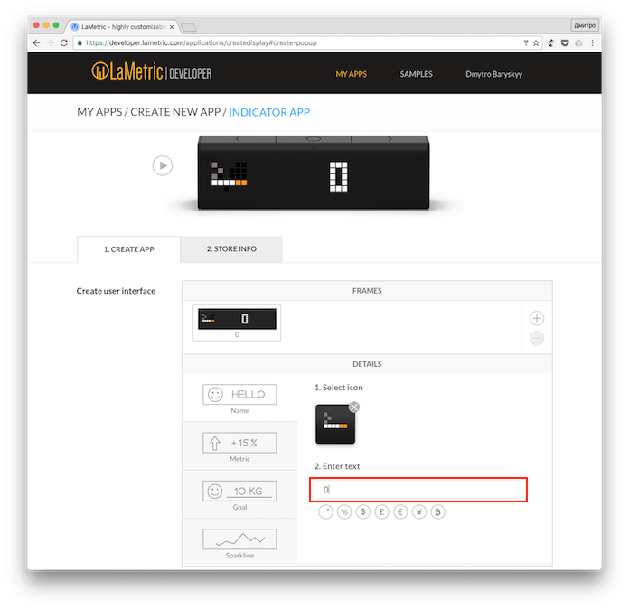

Choose "Local Push" communication type as we are going to push the data to the app.

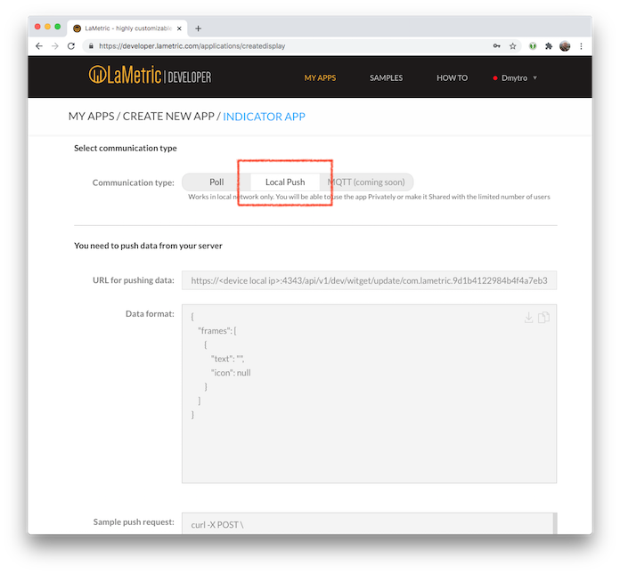

Go to the next step by clicking on the "Next" button.

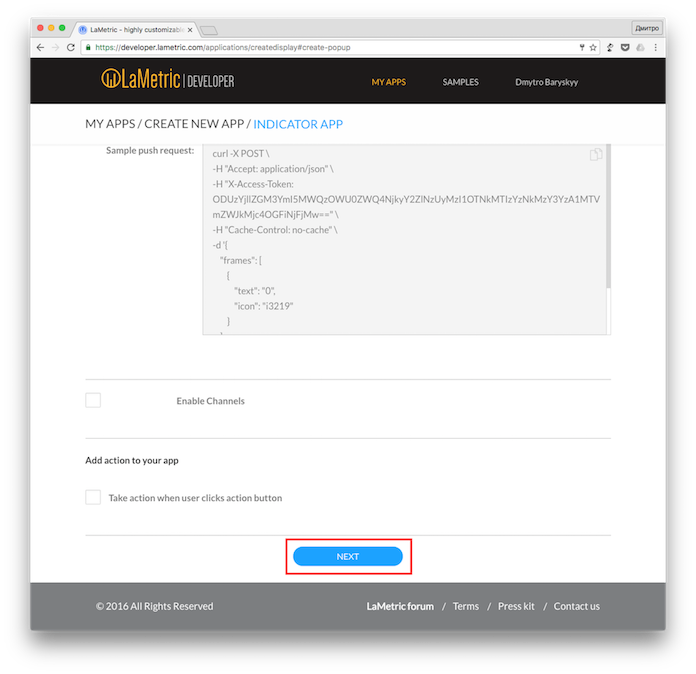

Now enter the name and description for your app. You'll find it in `LaMetric Market <http://apps.lametric.com>`_ and LaMetric Time app.

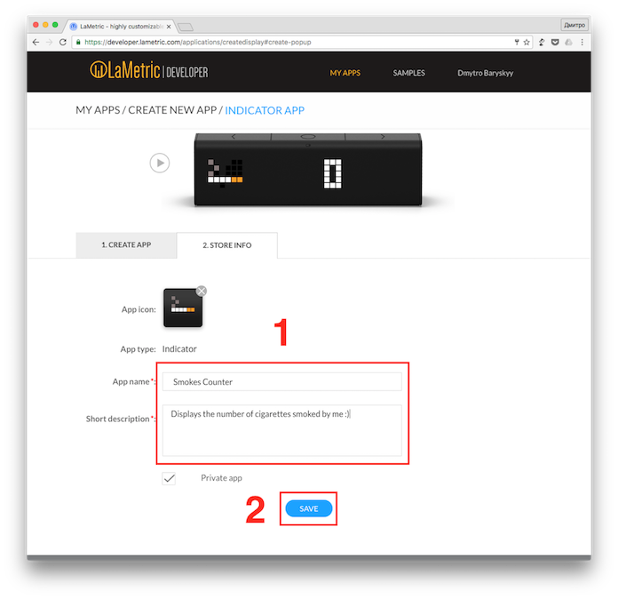

Once the app is saved you will be presented with local push URL, access token and data format. Now you have all the information to start delivering some data.

2. Publish the app and install it to your LaMetric Time
^^^^^^^^^^^^^^^^^^^^^^^^^^^^^^^^^^^^^^^^^^^^^^^^^^^^^^^
Let's click that "Publish" button at the top and wait for a confirmation email. It should take no longer than two minutes for the e-mail to reach your inbox. Once the email is delivered - congratulations, your app is live.

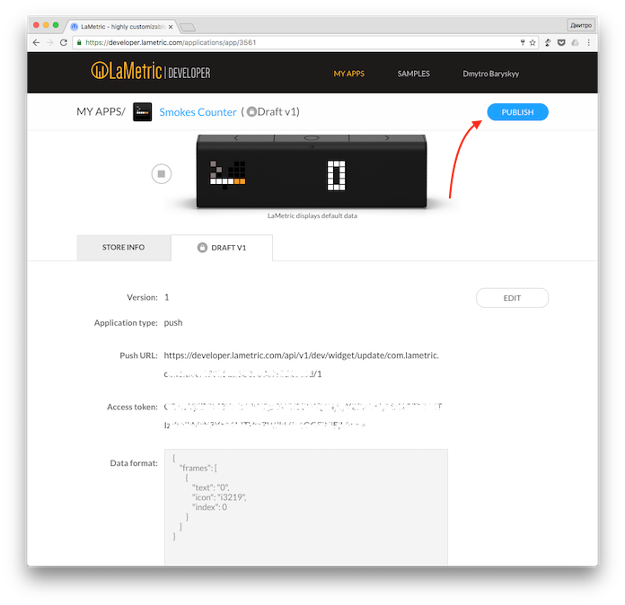

Now install your newly created app to your LaMetric Time device!

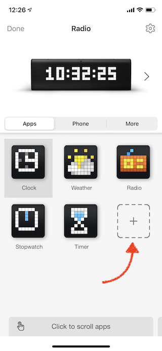
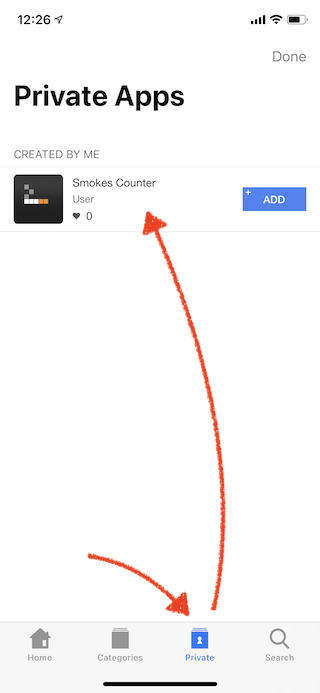
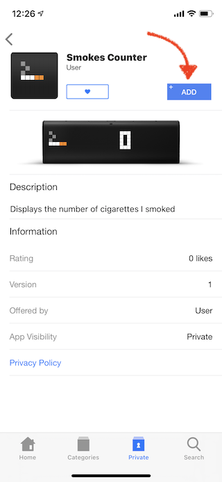
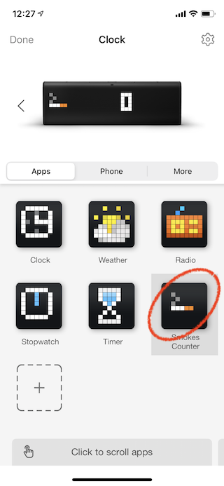

At this stage it should be active on LaMetric Time displaying default value.

.. image:: ../../images/app-indicator-push/value-0.jpg

3. Push some data!
^^^^^^^^^^^^^^^^^^

.. tip:: 
    We will be using `curl <https://curl.haxx.se/docs/manpage.html>`_ tool to make HTTP requests. While Linux and Mac users have it pre-installed, Windows users may want to `download <https://curl.haxx.se/download.html>`_ it.

Fortunately, there is curl example already on your app details page. Lets see how it looks in our case.

.. code-block:: groovy

    curl -X POST \
    -H "Accept: application/json" \
    -H "X-Access-Token: NzM2ZmI3ZTQyZDI0ZDk4OWExNTJmNTc1ZGQ3MzYyMjg2NDkwODA1MDMwODQ0ODAzNjMyNTgxYmI1YmIwYjBiOA==" \
    -H "Cache-Control: no-cache" \
    -k \
    -d '{
        "frames": [
            {
                "text": "1",
                "icon": 3219
            }
        ]
    }' \
    https://192.168.88.248:4343/api/v1/dev/widget/update/com.lametric.22e45a6407da88c0c938a8aaf8f7406f/1

.. note::
    Don't forget to replace X-Access-Token and URL with values specific to your app. You can find them on the app details page on "Published V1" tab.

Let's copy and paste that into terminal app, change value of "text" attribute to "1" and run!

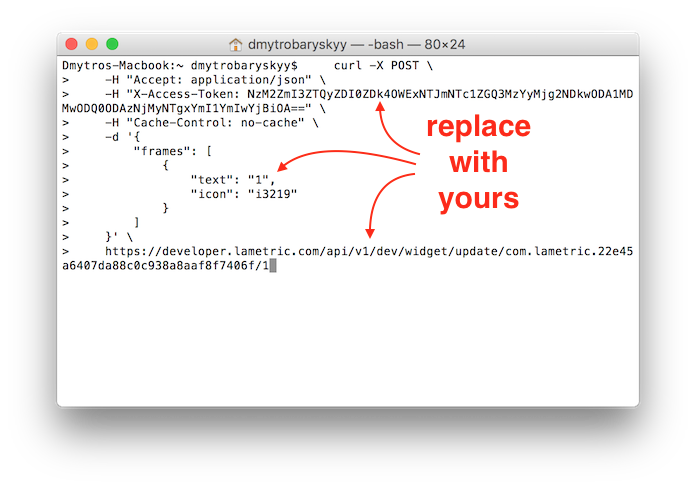

If value has changed - congratulations! You have successfully created your first LaMetric Time app! If it didn't, make sure X-Access-Token and URL are specific to your app and valid.

.. image:: ../../images/app-indicator-push/value-1.jpg

Poll Indicator App
------------------
Use "Poll" communication type when data you are trying to display changes often, requires authentication or additional user parameters. In this case indicator app will poll for data by itself with some predefined time interval. To simplify things a little, let's use `DropBox <http://www.dropbox.com>`_ as a backend.

Create Indicator App
^^^^^^^^^^^^^^^^^^^^

Prepare our backend by creating and uploading file named `data.json` to DropBox with the following contents:

.. code-block:: javascript

    {
        "frames": [
            {
                "icon":3219,
                "text":"2"
            }
        ]
    }

Get the link to your `data.json` file by pressing "Share" button next to it and choosing "Copy Link". 

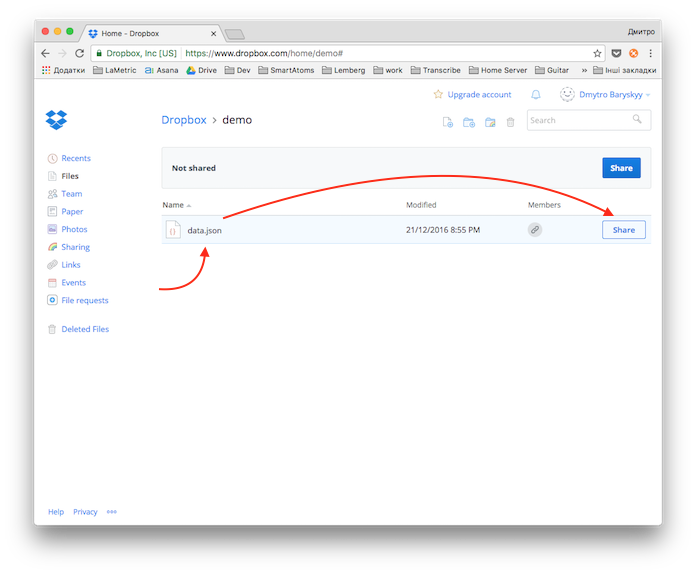
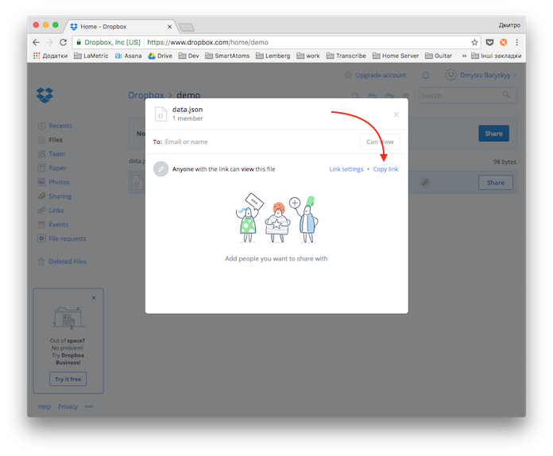
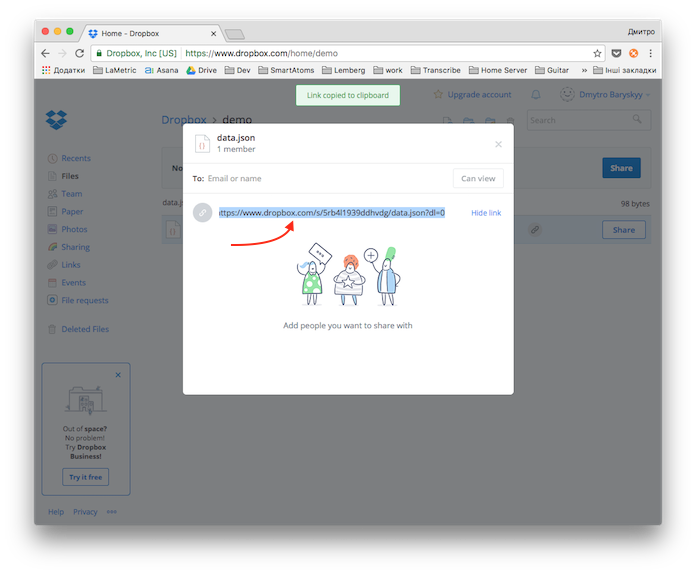

In our case it should look like this https://www.dropbox.com/s/5rb4l1939ddhvdg/data.json?dl=0. But, to make it work with LaMetric Time link must be direct. To make it direct let's change ``dl=0`` at the end to ``dl=1`` - https://www.dropbox.com/s/5rb4l1939ddhvdg/data.json?dl=1

Let's modify our "Push" app we made in previous section and make it poll for the data - just change the "Communication type" switch into "Poll" position.

Insert the link to `data.json` file into "URL to get data from" text field and choose "Poll frequency" to be set to some reasonable amount of time, for example 30 seconds.

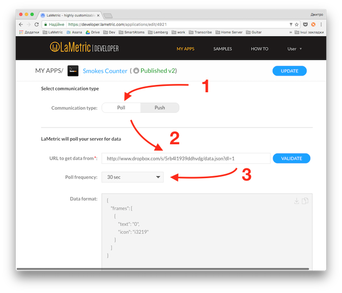

Publish app and install it to your LaMetric Time
^^^^^^^^^^^^^^^^^^^^^^^^^^^^^^^^^^^^^^^^^^^^^^^^
Finally, lets publish our modified app by pressing "UPDATE" button at the top. 

Once you received e-mail confirmation that your app is live - re-install it on your LaMetric Time device.

.. note::
    To delete LaMetric Time app, press and hold it's icon for a second and drop to "Delete" area on top.

Pull some data!
^^^^^^^^^^^^^^^
Let's try to change the number displayed on the device. Modify data.json file and change text value to "3": 

.. code-block:: javascript

    {
        "frames": [
            {
                "icon":"i3219",
                "text":"3"
            }
        ]
    }

Save the file and upload it to the DropBox. Within 30 seconds the number will change!

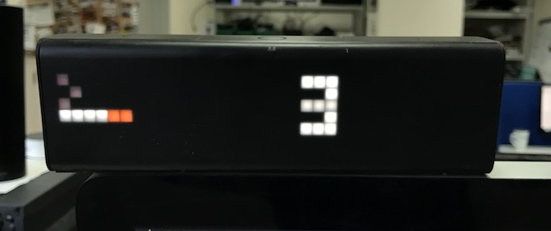

Congratulations! You have just learned how to create two types of indicator apps for your LaMetric Time!

What next?
----------
To learn more about LaMetric Indicator apps check other tutorials `here <https://lametric.freshdesk.com/solution/folders/6000213096>`_. Check :doc:`first-lametric-button-app` section to learn more about Button apps.
