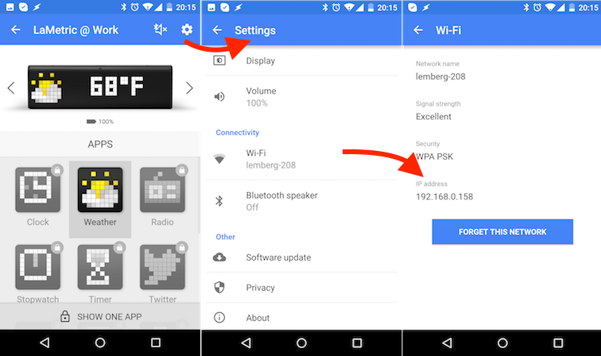
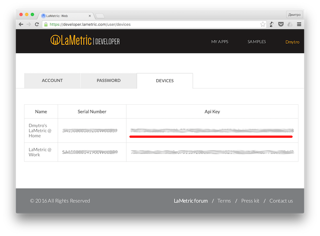

.. first-local-notification.rst:

First Local Notification
=========================

Let's send our first notification to the LaMetric Time device. In order to do that you need to follow few simple steps:

#. Discover LaMetric Time device's IP address
#. Discover API key
#. Do simple authenticated POST REST API call

Discover IP address
-------------------

IP address can be found in LaMetric Time app at Settings -> Wi-Fi -> IP Address.

Find API key
------------

API key can be found in `devices section <https://developer.lametric.com/user/devices>`_ of your developer account.

Send notification
-----------------

In order to send a notification you must do HTTP POST request to http://<lametric_time_ip_address>:8080/api/v2/device/notifications endpoint with headers:

*  Authorization: Basic <base64(dev:api_key)>
*  Content-Type: application/json

and body: ::
  
    {
       "model": { 
            "frames": [ 
                { 
                   "icon":2867, 
                   "text":"Hello!"
                } 
            ] 
        }
    } 

.. note::
    Copy paste curl example into your terminal window and don't forget to reaplace <your API key here> and <ip address> with valid values.

HTTP Example: ::

    $ curl -X POST -u "dev:<your API key here>" -H "Content-Type: application/json" -d " { \"model\": { \"frames\": [ { \"icon\":\"a2867\", \"text\":\"Hello\!\"} ] } }" http://<ip address>:8080/api/v2/device/notifications

HTTPS Example: ::

    $ curl -X POST -u "dev:<your API key here>" -H "Content-Type: application/json" -d " { \"model\": { \"frames\": [ { \"icon\":\"a2867\", \"text\":\"Hello\!\"} ] } }" https://<ip address>:4343/api/v2/device/notifications --insecure

Result::    

    200 OK
    { "success" : { "id" : "4" } }

.. image:: ../../images/simple_notification.gif
    :align: center

What's next?
------------

Now when you have learned how to make simple notification, it is time to create more complex one. Check out :doc:`Notification API reference <../../reference-docs/device-notifications>` for more details. If you are interested in displaying data on the device permanently (like counter or metric) - check out :doc:`first-lametric-indicator-app` section.
