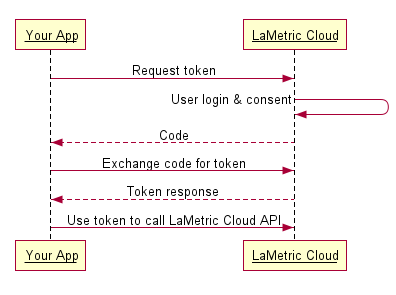
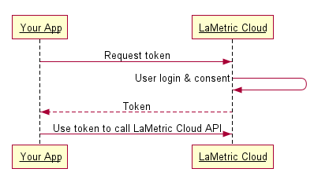

.. cloud-authorization
    
OAuth2 Authorization
====================

Overview
--------
The LaMetric API uses `OAuth 2.0 protocol <https://tools.ietf.org/html/draft-ietf-oauth-v2-12>`_ for simple but secure authentication and authorization. We support the most common OAuth 2.0 scenarios. Please keep in mind, that all requests to protected APIs must be made over SSL (https://).

The LaMetric API requires authentication for the requests made on behalf of a user. Each such request requires an **access_token**. Tokens are unique and should be stored securely. 

Basic Steps
^^^^^^^^^^^

All applications should follow a basic pattern when accessing a LaMetric API using OAuth 2.0. At high level you should follow these four steps:

1. Obtain OAuth 2.0 credentials from the LaMetric Developer.
````````````````````````````````````````````````````````````
Visit `LaMetric Developer <https://developer.lametric.com>`_ to obtain OAuth 2.0 credentials (client id and client secret). You must create new Notification Source by pressing on "Create new app" button.

2. Obtain an access token from the LaMetric Cloud Server.
``````````````````````````````````````````````````````````
Your application must obtain an access token that grants access to specific API. Single access token can grant different degree of access to different API. This is controlled via `scope` parameter your application must set during request of access-token.

3. Send the access token to an API.
`````````````````````````````````````
When access-token is obtained your application must send it to the LaMetric API in an HTTP authorization header.

4. Refresh the access token, if necessary.
```````````````````````````````````````````
Access tokens have limited lifetime. If your application must have access to the API beyond that lifetime it should request and store refresh token. Refresh token allows application to request new access tokens.

Server Side (Explicit) Flow
----------------------------




Step One: Direct your user to our authorization URL
^^^^^^^^^^^^^^^^^^^^^^^^^^^^^^^^^^^^^^^^^^^^^^^^^^^
::

	https://developer.lametric.com/api/v2/oauth2/authorize/?client_id=CLIENT-ID&redirect_uri=REDIRECT-URI&response_type=code&scope=SCOPE&state=STATE

At this point, we present the user with a login screen and then a confirmation screen where to grant your app access to his/her LaMetric data.


Step Two: Receive the redirect from LaMetric
^^^^^^^^^^^^^^^^^^^^^^^^^^^^^^^^^^^^^^^^^^^^
Once a user authorizes your application, we issue a redirect to your redirect_uri with a code parameter to use in step three.
::

	http://your-redirect-uri?code=CODE&state=STATE

Note that the host and path components of your redirect URI must match exactly (including trailing slashes) your registered redirect_uri. You may also include additional query parameters in the supplied redirect_uri, if you need to vary your behavior dynamically.


If your request for approval is denied by the user, then we will redirect the user to your **redirect_uri** with the error message in parameters.


Step Three: Request the access_token
^^^^^^^^^^^^^^^^^^^^^^^^^^^^^^^^^^^^
On this step you need to exchange the code you have received in previous step for the access token. To do that you just have to POST the code, along with app identification parameters to our token endpoint. Parameters are:

* **client_id**: your client id
* **client_secret**: your client secret
* **grant_type**: authorization_code 
* **redirect_uri**: the redirect_uri you used in authorization request.
* **code**: the exact code you received during the authorization.

Sample request:
::

	curl -F 'client_id=CLIENT_ID' \
	    -F 'client_secret=CLIENT_SECRET' \
	    -F 'grant_type=authorization_code' \
	    -F 'redirect_uri=AUTHORIZATION_REDIRECT_URI' \
	    -F 'code=CODE' \
	    https://developer.lametric.com/api/v2/oauth2/token

If successfull this request will return OAuth 2.0 that you can use to make authenticated API requests. You will also get refresh_token, expiration interval and scopes. Example:
::

	{
	    "access_token":"0334613c79f116511fb81bc70f6dbaf20d002143",
	    "expires_in":3600,
	    "token_type":"Bearer",
	    "scope":"basic devices_read",
	    "refresh_token":"d7ab5645e7dcc9f227ee69f40962a19e15c80b04"
	}


Client Side (Implicit) Flow
---------------------------




Step One: Direct your user to our authorization URL 
^^^^^^^^^^^^^^^^^^^^^^^^^^^^^^^^^^^^^^^^^^^^^^^^^^^
::

	https://developer.lametric.com/api/v2/oauth2/authorize/?client_id=CLIENT-ID&redirect_uri=REDIRECT-URI&response_type=token&scope=SCOPE&state=STATE

User will be presented with login prompt and then a confirmation screen where they grant permissions to access their LaMetric Account data. 


Step Two: Receive the access_token via the URL fragment
^^^^^^^^^^^^^^^^^^^^^^^^^^^^^^^^^^^^^^^^^^^^^^^^^^^^^^^^

As soon as the user is authenticated and authorized your aplication, LaMetric Cloud will redirect them to your redirect_url with the access_token, token_type, scope and state in the URL fragment. It will look like this:
::

	http://redirect-uri/#access_token=ACCESS-TOKEN&expires_in=3600&token_type=Bearer&scope=SCOPE&state=STATE


Refreshing Access Token
-----------------------

You should refresh access token as soon as it is expired. This is the HTTP response you get when access token is not valid anymore:

::

    HTTP/1.1 401 Unauthorized
    Date: Fri, 17 Jun 2016 14:30:00 GMT
    Server: Apache
    X-Powered-By: PHP/5.4.45
    Www-Authenticate: native
    X-Powered-By: PleskLin
    Connection: close
    Transfer-Encoding: chunked
    Content-Type: application/json; charset=UTF-8

    {"errors":[{"message":"Unauthorized"}]}

To refresh the token do POST request to the token API:
::

    curl -F 'client_id=CLIENT-ID' \
        -F 'client_secret=CLIENT-SECRET' \
        -F 'grant_type=refresh_token' \
        -F 'refresh_token=REFRESH-TOKEN' \
        https://developer.lametric.com/api/v2/oauth2/token

An example response JSON may look like this: ::

    {
        "access_token":"65764004f094639190b93d7e75e2c4dfa343f3c3",
        "expires_in":3600,
        "token_type":"Bearer",
        "scope":"basic devices_read",
        "refresh_token":"b463576cc489e4a3f4b913a2505726f97635f5e7"
    }

Scopes
-------------

+----------------------+---------------------------------------------------+
|*Scope*               |*Description*                                      |
+----------------------+---------------------------------------------------+
|basic                 | Allows to read user's profile (name, e-mail, etc.)|
+----------------------+---------------------------------------------------+
|devices_read          | Allows to get information about devices that are  |
|                      | connected to the user's account.                  |
+----------------------+---------------------------------------------------+
|devices_write         | Allows to update user's devices (rename for       |
|                      | example)                                          |
+----------------------+---------------------------------------------------+

It is possible to combine scopes like this::

	scope=basic+devices_read+devices_write
