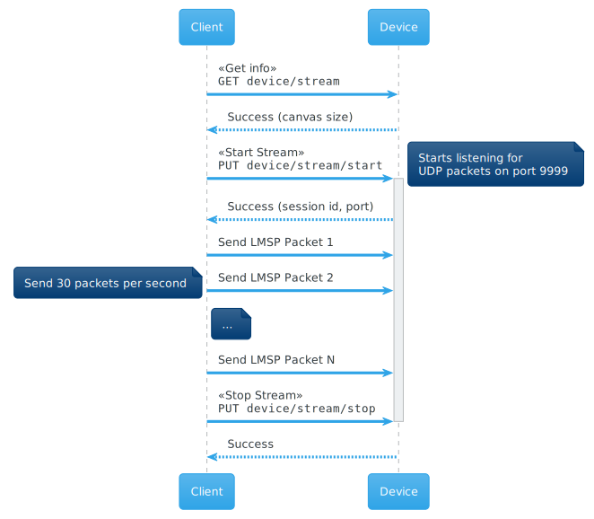

Streaming API
=============

Endpoints
---------

========= ======================================= ==================================================
Method    Path                                    Description
========= ======================================= ==================================================
GET       `/api/v2/device/stream`_                Retrieve the current streaming status and settings
PUT       `/api/v2/device/stream/start`_          Start streaming to the LaMetric device
PUT       `/api/v2/device/stream/stop`_           Stop streaming to the LaMetric device
========= ======================================= ==================================================

Overview
--------

The LaMetric Streaming API allows you to stream content to a LaMetric SKY device. This section describes the available endpoints 
for the Streaming API and provides detailed information about the LMSP (:ref:`LaMetric Streaming Protocol <lametric-streaming-protocol>` ) 
used for UDP streaming.

In general, the streaming process looks as follows:

1. API Client retrieves information about streaming status and the size of the canvas from the Device
2. API Client starts a stream and receives UDP port and Session Id
3. API Client sends :ref:`LMSP <lametric-streaming-protocol>` packets as fast as 30 FPS
4. API Client stops stream when done.

.. _/api/v2/device/stream:

Get Stream Status
-----------------
================  ===========================================
URL               /api/v2/device/stream                                 
Method            GET                                        
Authorization     basic
API Version       2.3.0                                         
================  ===========================================

Description
^^^^^^^^^^^
Retrieves the current stream status and settings.

Body
^^^^
.. code-block:: json

    {
      "protocol": "lmsp",
      "version": "1.0",
      "port": 9999,
      "status": "[stopped|receiving]",
      "canvas": { 
           "pixel": {
               "size": { "width": 8, "height": 16 }
           },
           "triangle": { 
               "size": { "width": 16, "height": 32 }
           }
      }
    }

=================== =============== ===========================================================
**Stream Object**
-----------------------------------------------------------------------------------------------
**Field**           **Type**        **Description**
------------------- --------------- -----------------------------------------------------------
``protocol``        Integer         ``lmsp`` - LaMetric Streaming Protocol
``version``         String          Version in format "<major>.<minor>", version of the protocol
``port``            Boolean         UDP port opened on the device. Usually 9999
``status``          String          ``receiving`` or ``stopped``
``canvas.pixel``    Object          Canvas with "square" pixels, contains size property
``canvas.triangle`` Object          Canvas with "triangular" pixels, contains size property               
=================== =============== ===========================================================

Example
^^^^^^^

**Request**

.. code-block:: REST

    GET https://<device ip address>:4343/api/v2/device/stream

    Authorization: Basic <Base64("dev:<device API key>")>
    Content-Type: application/json
    Accept: applciation/json

**Response**

.. code-block:: json

    {
      "protocol": "lmsp",
      "version": "1.0",
      "port": 9999,
      "status": "stopped", 
      "canvas": { 
           "pixel": { 
               "size": { "width": 24, "height": 8 }
           },
           "triangle": {
               "size": { "width": 48, "height": 16 }
           }
      }
    }

.. _/api/v2/device/stream/start:

Start Stream
------------
================  ===========================================
URL               /api/v2/device/stream/start                                 
Method            PUT                                        
Authorization     basic
API Version       2.3.0                                         
================  ===========================================

Description
^^^^^^^^^^^
Before you will be able to stream UDP packets to the device, you need to start the streaming by calling this endpoint.
This method also allows to configure some aspects of the streaming, like:

1. Render mode
2. Fill Type
3. Post processing

**Render Mode**

There are two render modes - Pixel and Triangle. 

In `pixel` mode you control individual square pixels. Best suits for cases when digital image or text should be displayed. 

In `triangle` mode you control individual triangles. Best suits for abstract effects.

**Fill Type**

LaMetric SKY devices have limitation on the canvas size. In some cases actual screen real estate can be larger than 
the canvas size available for drawing. In this case streamed content will be upscaled or tiled to fill the area. 

**Post Processing**

Content can be displayed on LaMetric device without modifications or additional effect can be applied.
Currently `fading_pixels` effect is supported

Body
^^^^
.. code-block:: json

    {
      "canvas": {
          "fill_type": "[scale|tile]",
          "render_mode": "[pixel|triangle]",
          "post_process": {
              "type": "[none|effect]",
              "params": {
                  "effect_type": "fading_pixels",
                  "effect_params": {
                      "smooth": true,
                      "pixel_fill": 1,
                      "fade_speed": 0.005,
                      "pixel_base": 0.05
                  }
              }
          }
      }
    }

=================== =============== ===========================================================
**Canvas Object**
-----------------------------------------------------------------------------------------------
**Field**           **Type**        **Description**
------------------- --------------- -----------------------------------------------------------
``fill_type``       String          Valid values are ``scale`` and ``tile``.

                                    ``scale`` – content will be scaled to fill the screen

                                    ``tile`` – content will be tiled to fill the screen
``render_mode``     String          Valid values are ``pixel`` and ``triangle``.

                                    ``pixel`` - each pixel of content will be mapped to one 
                                    square pixel on a device

                                    ``triangle`` - each pixel of content will be mapped to 
                                    one triangular pixel area of a device.
``post_process``    Object          Controls post processing effects
=================== =============== ===========================================================

=================== =============== ===========================================================
**PostProcess Object**
-----------------------------------------------------------------------------------------------
**Field**           **Type**        **Description**
------------------- --------------- -----------------------------------------------------------
``type``            String          Optional. ``none`` (default) or ``effect``.

                                    ``none`` – no post processing effect is applied.

                                    ``effect`` – effect will be added on top of the content.
``params``          Object          Optional. Effect parameters
=================== =============== ===========================================================

=================== =============== ===========================================================
**Params Object**
-----------------------------------------------------------------------------------------------
**Field**           **Type**        **Description**
------------------- --------------- -----------------------------------------------------------
``effect_type``     Stirng          Only ``fading_pixels`` is currently supported.
``effect_params``   String          Paremeters of a specific effect 
=================== =============== ===========================================================

=================== =============== ===========================================================
**Fading Pixels Parameters Object**
-----------------------------------------------------------------------------------------------
**Field**           **Type**        **Description**
------------------- --------------- -----------------------------------------------------------
``smooth``          Boolean         ``true`` - pixel appears smoothly, ``false`` - pixel 
                                    appears instantly
``pixel_fill``      Integer         fill area percentage, [0..1]. ``1`` - pixels fill 100%
                                    of area, ``0`` - pixels fill no area.
``fade_speed``      Float           pixel brightness that is added to the pixel per rendering cycle,
                                    [0..1]. Bigger the number, faster the pixel fades in/out
``pixel_base``      Float           base pixel brightness, [0..1], where ``0`` – off, 
                                    ``1`` – full brightness
=================== =============== ===========================================================

Response
^^^^^^^^

.. code-block:: json

    {
        "success": {
            "data": {
                "canvas": {
                    "fill_type": "[scale|tile]",
                    "render_mode": "[pixel|triangle]"
                },
                "port": 9999,
                "session_id": "<session_id>",
                "status": "[receiving|stopped]"
            },
            "path": "/api/v2/device/stream/start"
        }
    }

=================== =============== ===========================================================
**Response Object**
-----------------------------------------------------------------------------------------------
**Field**           **Type**        **Description**
------------------- --------------- -----------------------------------------------------------
``port``            Number          UDP port where :ref:`LMSP <lametric-streaming-protocol>`
                                    packets should be sent
``session_id``      String          Session ID is used in LaMetric Streamin Protocol to send 
                                    UDP packets. If current session ID on the device differs
                                    from the one in UDP packet – content will not be displayed.
=================== =============== ===========================================================

Example
^^^^^^^

**Request**

.. code-block:: REST

    PUT /api/v2/device/stream/start
    Host: 192.168.170.83:4343
    Authorization: Basic <Base64("dev:<device API key>")>
    Content-Type: application/json
    Accept: applciation/json

    {
      "canvas": {
          "fill_type": "scale",
          "render_mode": "pixel",
          "post_process": {
              "type": "none"
          }
      }
    }

**Response**

* **Status 200**

  .. code-block:: json

      {
         "success": {
             "data": {
                  "canvas": {
                     "fill_type": "scale",
                     "render_mode": "pixel"
                  },
                 "session_id": "a2891aa891ab4f8e8a1a16eb319b00f3",
                 "status": "receiving",
                 "port": 9999
             },
             "path": "/api/v2/device/stream/start"
         }
      }

.. _/api/v2/device/stream/stop:

Stop Stream
-----------

================  ===========================================
URL               /api/v2/device/stream/stop                                 
Method            PUT                                        
Authorization     basic
API Version       2.3.0                                         
================  ===========================================

Description
^^^^^^^^^^^
Stop streaming content to the LaMetric device.

Example
^^^^^^^

**Request**

.. code-block:: REST

    GET /api/v2/device/stream/stop
    Host: 192.168.170.83:4343
    Authorization: Basic <Base64("dev:<device API key>")>
    Content-Type: application/json
    Accept: applciation/json

**Response**

.. code-block:: json

    {
        "success": {
            "data": {
                "status": "stopped"
            },
            "path": "api/v2/device/stream/stop"
        }
    }
  

.. _lametric-streaming-protocol:

LaMetric Streaming Protocol (LMSP)
----------------------------------

The LMSP protocol is used for streaming content to the LaMetric SKY device via UDP. Below is a detailed description of the UDP packet format used by LMSP.

UDP Packet Format
^^^^^^^^^^^^^^^^^

+--------------------+-----------+------------------------------------------------------------------+
| Field              | Size      | Description                                                      |
+====================+===========+==================================================================+
| Protocol name      | 4 bytes   | ``lmsp``                                                         |
+--------------------+-----------+------------------------------------------------------------------+
| Version            | 2 bytes   | ``1``                                                            |
+--------------------+-----------+------------------------------------------------------------------+
|| Session ID        || 16 bytes || UUID, if session ID is different from current session ID -      |
||                   ||          || packets will be ignored                                         |
+--------------------+-----------+------------------------------------------------------------------+
| Content Encoding   | 1 byte    | ``0x00`` - RAW, ``0x01`` - PNG, ``0x02`` - JPEG, ``0x03`` - GIF  |
+--------------------+-----------+------------------------------------------------------------------+
| Reserved           | 1 byte    | ``0x00``                                                         |
+--------------------+-----------+------------------------------------------------------------------+
| Canvas Area Count  | 1 byte    | The number of canvas areas in this payload (parts of the image)  |
+--------------------+-----------+------------------------------------------------------------------+
| Reserved           | 1 byte    | ``0x00``                                                         |
+--------------------+-----------+------------------------------------------------------------------+
| Canvas Area X      | 2 bytes   | ``[0..canvas_size]`` Get canvas size using /api/v2/device/stream |
+--------------------+-----------+------------------------------------------------------------------+
| Canvas Area Y      | 2 bytes   | ``[0..canvas_size]`` Get canvas size using /api/v2/device/stream |
+--------------------+-----------+------------------------------------------------------------------+
| Canvas Area Width  | 2 bytes   | ``[0..canvas_width]`` Width of the area                          |
+--------------------+-----------+------------------------------------------------------------------+
| Canvas Area Height | 2 bytes   | ``[0..canvas_height]`` Height of the area                        |
+--------------------+-----------+------------------------------------------------------------------+
|| Canvas Area Data  || 2 bytes  || Length of the binary data                                       |
|| Length            ||          ||                                                                 |
+--------------------+-----------+------------------------------------------------------------------+
| Canvas Area Data   | <var>     | Binary data                                                      |
+--------------------+-----------+------------------------------------------------------------------+

The total size of the UDP packet header is 36 bytes, plus the size of the binary data part.

.. tip::
  When handling multi byte values, use little endian byte order

Example
^^^^^^^
In this example we will be streaming image content to a LaMetric SKY device in pixel mode

1. Get the canvas size from the device
~~~~~~~~~~~~~~~~~~~~~~~~~~~~~~~~~~~~~~

First of all we need to know the size of canvas on a device.

Request

.. code-block:: REST

  GET /api/v2/device/stream HTTP/1.1
  Host: 192.168.170.83:4343
  Authorization: Basic <Base64("dev:<device API key>")>
  Accept: application/json
  Content-Type: application/json

Response

.. code-block:: json

    {
      "protocol": "lmsp",
      "version": "1.0",
      "port": 9999,
      "status": "stopped", 
      "canvas": { 
           "pixel": { 
               "size": { "width": 24, "height": 8 }
           },
           "triangle": {
               "size": { "width": 48, "height": 16 }
           }
      }
    }

Looks like the pixel canvas is 24x8.

2. Start a stream
~~~~~~~~~~~~~~~~~

Will be using fill type ``scale`` and render mode ``pixel`` without post processing effect.

.. code-block:: REST

  PUT /api/v2/device/stream/start HTTP/1.1
  Host: 192.168.170.83:4343
  Authorization: Basic <Base64("dev:<device API key>")>
  Accept: application/json
  Content-Type: application/json
  Content-Length: 481

    {
        "canvas": {
            "fill_type": "scale",
            "render_mode": "pixel",
            "post_process": {
                "type": "none"                
            }
        }
      }

Response

.. code-block:: json

  {
    "success": {
        "data": {
            "canvas": {
                "fill_type": "scale",
                "render_mode": "pixel"
            },
            "port": 9999,
            "session_id": "a2891aa891ab4f8e8a1a16eb319b00f3",
            "status": "receiving"
        },
        "path": "/api/v2/device/stream/start"
    }
  }

Status ``receiving`` indicates that the device is listening for the incoming UDP packets. 
We also will need the ``port`` and the ``session_id`` on the next step. 

3. Send UDP packets to the port 9999 of the following structure as fast as 30 FPS
~~~~~~~~~~~~~~~~~~~~~~~~~~~~~~~~~~~~~~~~~~~~~~~~~~~~~~~~~~~~~~~~~~~~~~~~~~~~~~~~~

Now we use *Session Id*, *canvas size* and the actual *content* to make the LMSP Packet and then send it to the port 9999 of the device.

.. code-block:: C++

    [
      0x6c, 0x6d, 0x73, 0x70, // "lmsp"
      0x01, 0x00, // 1
      0xa2, 0x89, 0x1a, 0xa8, 0x91, 0xab, 0x4f, 0x8e, 0x8a, 0x1a, 0x16, 0xeb, 0x31, 0x9b, 0x00, 0xf3,  // session id
      0x00, // Raw data (no encoding)
      0x00, // reserved (not used)
      0x01, // 1 area 
      0x00, // reserved (not used)
      0x00, 0x00, // x = 0
      0x00, 0x00, // y = 0
      0x18, 0x00, // width = 24 = 0x18 = 0x18,0x00
      0x08, 0x00, // height = 8 = 0x8 = 0x08,0x00
      0x40, 0x02, // data length = 24 * 8 * 3 = 576 = 0x240 = 0x40,0x02
      0x00, 0x00, 0x00, ... // data in RGB888 format (R, G, B, R, G, B, ...)
    ]

4. Stop the stream when done
~~~~~~~~~~~~~~~~~~~~~~~~~~~~

When stream gets stopped, device will return to its normal operation mode.

.. code-block:: REST

  PUT /api/v2/device/stream/stop HTTP/1.1
  Host: 192.168.170.83:4343
  Authorization: Basic <Base64("dev:<device API key>")>
  Accept: application/json
  Content-Type: application/json
